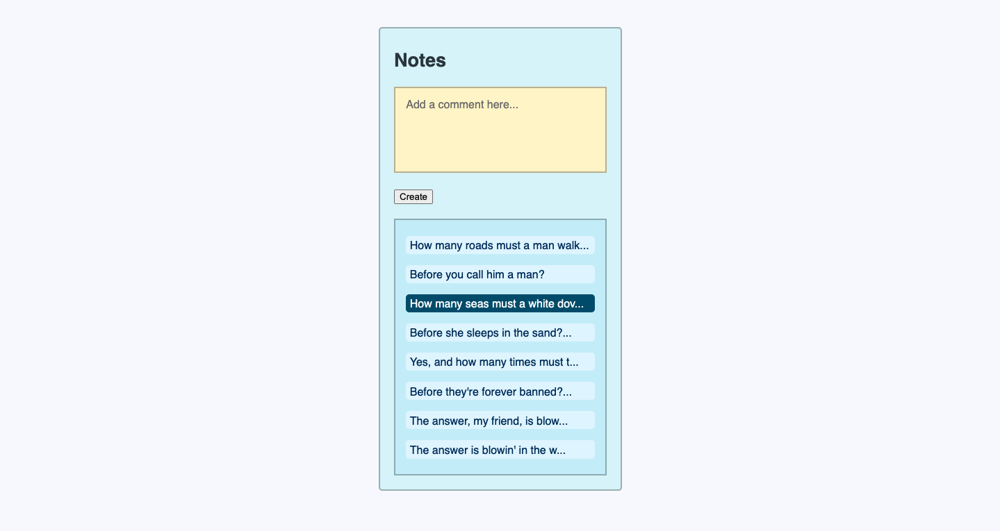

## Introduction

The goals of this week were:

1. Test-drive a simple Javascript program running in a web browser, using modern JS build tools.
2. Use the DOM API to build a web user interface for this program.
3. Build a single-page web application fetching and updating remote data using JS.

Most of the week was spent learning the fundamentals in pair-programming sessions. I completed this with[Ben Dowsett](https://github.com/Zimmja/DOM-practice), [Simon Jacobs](https://github.com/Zimmja/Matt-and-Simon), [Jacob Hanrahan](https://github.com/JacobCH93/Playing_with_Fetch_JS). Building the actual application was completed solo.



### Project setup

1. Export the contents of notes-backend-server.zip
2. Initiate npm with "npm -y init"
3. Install get with "npm install jest"
4. Added a .gitignore file to prevent repo upload of node_modules folders
5. Run "npm install express --save"
6. Run "brew install jq"

### Interaction

1. Open index.html in a browser to view the app
2. To run the server, go to the notes-backend-server directory (i.e. `cd notes-backend-server`) and enter `node index.js` in the console
3. Use command + C to close the server

### Editing

The following lines exist in the package.json file:

```
"build": "esbuild index.js --bundle  --outfile=bundle.js",
"buildw": "esbuild index.js --bundle  --outfile=bundle.js --watch",
```

These allow commands to be run in the root directory console. When developing this app further, use the following commands:

1. Use `npm run build` to rebuild the app once amends have been made
2. Use `npm run buildw` to initiate a watchful build (i.e. continuously builds as amends are made)
